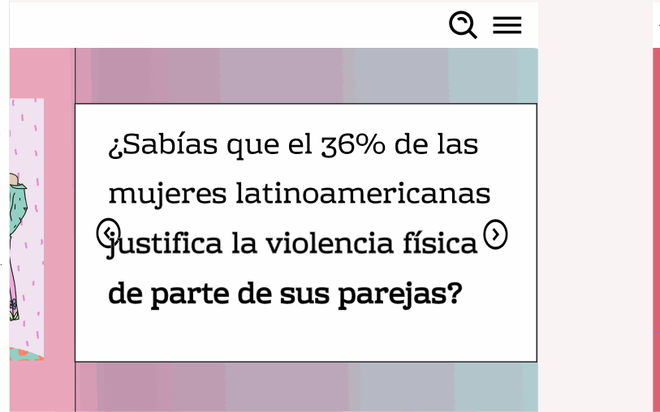
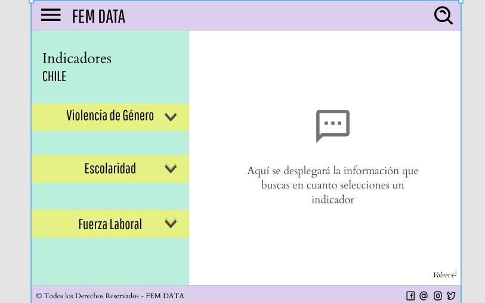

# **Data Lovers**
## Data lover WorldBank
###Data y Feminismo

El abuso y la invisibilización de las  mujeres ha sido objeto de preocupación común en todo el mundo y ello ha propiciado que, las agrupaciones conformadas con la finalidad de terminar con el patriarcado, extiendan su lucha no solo en el ambito meramente social si no que asi también en lo que a procesos de investigación y creación de nuevos espacios de construcción intelectual . Algunas son secciones de importantes organizaciones internacionales, otras son agencias o institutos de investigación feminista, también hay redes de activistas que aglutinan a mujeres de todo el planeta u organizaciones que actúan en un país (o países) determinado. Pero lo que tienen en común todas ellas, es el interés por analizar, combatir y transformar las sociedades patriarcales que configuran unas redes de dominación y violencia frente a ellas que las someten a una situación de desigualdad estructural.

###FemData
 Busca ser un aporte en la construcción del feminismo, dando herramientas para la investigación y exposición de las problematicas que han vivido por siglos las mujeres, aportando con datos y los filtros especificos de estos.

 ## Usuarias

 Esta pagina esta pensada para organizaciones feministas, estudiantes y muejres interesadas en la investigación, con una edad aproximada de 20 a 45 años .
 se realizo una encuestaa 20 muejeres donde se pregunto por temáticas e preferencia en la forma de mostrar la data

 Para comenzar creamos un figma de baja calidad, el cual fue probado en 4 mujeres, 

 Donde obtuvimos feedback con respecto principalmente a los colores y estilos de la pagina y la necesidad de que esta fuera de simple lectura e interfaz, ya que la mayoria de esapcios con esta información son egorrosos y fomes.
 Luego creamos la segunda idea en figma.
 

 donde el feedback fue mucho más ameno y dispuesto, teniendo solo complicaciones con el boton volver. el principal comentario que obtuvimos fue la necesidad de que existan datos y paginas que los contengan de facil acceso y entendimiento para asi poder comunizar el estudio bajo realidades comprobadas o incluso poder criticar estas bases de datos a través de la comparación de distintas instituciones a cargo de estas.
 
 
 El diseño final incluye indicadores por país, y por tematicas de género con mas interes, como son 
 -Violencia
 -Escolaridad
 -Empleabilidad

 #### Pagina final.
 NO logramos alcanzar el diseño final ni la división por temáticas, pero si se genera un filtro por país y indicadores de cada uno en temas de poblacion, violencia y escolaridad, haciendo una pagina amena de colores acorde a los establecidos colectivamente como representantes  de la lucha feminista mundial.