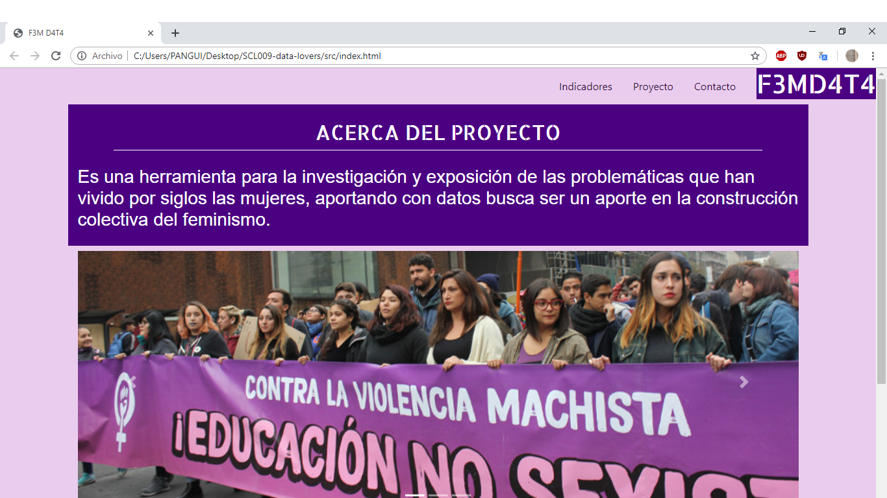

# **Data Lovers**
## Data lover WorldBank
###Data y Feminismo

El abuso y la invisibilización de las  mujeres ha sido objeto de preocupación común en todo el mundo y ello ha propiciado que, las agrupaciones conformadas con la finalidad de terminar con el patriarcado, extiendan su lucha no solo en el ámbito meramente social si no que así también en lo que a procesos de investigación y creación de nuevos espacios de construcción intelectual. Algunas son secciones de importantes organizaciones internacionales, otras son agencias o institutos de investigación feminista, también hay redes de activistas que aglutinan a mujeres de todo el planeta u organizaciones que actúan en un país (o países) determinado. Pero lo que tienen en común todas ellas, es el interés por analizar, combatir y transformar las sociedades patriarcales que configuran unas redes de dominación y violencia frente a ellas que las someten a una situación de desigualdad estructural.

###FemData
 Busca ser un aporte en la construcción del feminismo, dando herramientas para la investigación y exposición de las problemáticas que han vivido por siglos las mujeres, aportando con datos y los filtros específicos de estos.

 ## Usuarias

 Esta página está pensada para organizaciones feministas, estudiantes y mujeres interesadas en la investigación, con una edad aproximada de 20 a 45 años.
 Se realizaron encuestas a 20 mujeres donde se preguntó por temáticas e preferencia en la forma de mostrar la data

 Para comenzar creamos un figma de baja calidad, el cual fue probado en 4 mujeres.

 Donde obtuvimos feedback con respecto principalmente a los colores y estilos de la página y la necesidad de que esta fuera de simple lectura e interfaz, ya que la mayoría de espacios con esta información son engorrosos y fomes.
 Luego creamos la segunda idea en figma.

 

 
El feedback fue mucho más ameno y dispuesto, teniendo solo complicaciones con el botón volver. El principal comentario que obtuvimos fue la necesidad de que existan datos y páginas que los contengan de fácil acceso y entendimiento para así poder comunizar el estudio bajo realidades comprobadas o incluso poder criticar estas bases de datos a través de la comparación de distintas instituciones a cargo de estas.

 
 
 
El diseño final incluye indicadores por país, y por temáticas de género con más interés, como son 
 -Violencia
 -Escolaridad
 -Empleabilidad

 #### Pagina final.

 
NO logramos alcanzar el diseño final ni la división por temáticas, pero si se genera un filtro por país e indicadores de cada uno en temas de población, violencia y escolaridad, haciendo una página amena de colores acorde a los establecidos colectivamente como representantes  de la lucha feminista mundial.

 

 ### Conclusión
 Es interesante comprender como tratar y mostrar una data en la sociedad actual, creo que se logró un acercamiento al ideal de página, hay que trabajar diseño de logo y proponer gráficos que sean comprensibles a la usuaria, y junto con esto ordenar filtros por mas temáticas específicas.

